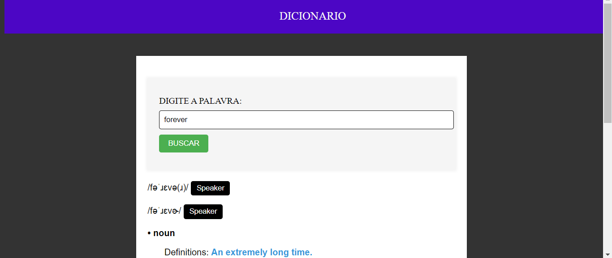
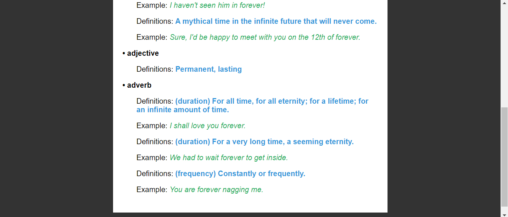

# DICIONARIO COM SVELTE
👨‍🏫BUSCADOR DE PALAVRAS (DICIONÁRIO) COM SVELTE E API "DICTIONARYAPI.DEV".

 <br> 
 <br> 

## DESCRIÇÃO:
- O projeto é um aplicativo de dicionário interativo baseado na web, que permite aos usuários pesquisar o significado de palavras em inglês. Ele oferece uma interface simples e fácil de usar, onde os usuários podem inserir uma palavra e receber imediatamente informações sobre sua definição, pronúncia, classe gramatical e exemplos de uso.

- O aplicativo utiliza a API ["DICTIONARYAPI.DEV"](https://dictionaryapi.dev/) para buscar as informações das palavras pesquisadas pelos usuários. Essa API fornece um amplo banco de dados de palavras em inglês, juntamente com suas definições e outras informações relevantes.

## COMPONENTES:
O aplicativo consiste em três componentes principais:

1. **Formulário de Pesquisa:** Uma caixa de entrada onde os usuários podem digitar a palavra que desejam pesquisar. Ao clicar no botão "BUSCAR", a palavra é enviada para a API de dicionário para recuperar suas informações.

2. **Loader:** Um componente de carregamento exibido enquanto os dados da palavra estão sendo buscados na API. Isso fornece feedback visual ao usuário de que a pesquisa está em andamento.

3. **Resultados da Pesquisa:** Uma área onde os resultados da pesquisa são exibidos. Isso inclui a pronúncia da palavra, sua classe gramatical e uma ou mais definições, juntamente com exemplos de uso, se disponíveis.

## EXECUTANDO O PROJETO:
1. **Instalar as dependências do projeto**:
   - Execute o comando no diretório `CODIGO/`:
     ```cmd
     npm install
     ```
   Este comando instala todas as dependências listadas no arquivo `package.json` do seu projeto. 

2. **Executando o Aplicativo:**
   - Ainda no diretório `CODIGO/`, abra o terminal ou prompt de comando e digite o seguinte comando:
   ```bash
   npm run dev
   ```
   - Acesse o aplicativo no navegador visitando `http://localhost:8080/`.

3. **Usando o APP:**
   1. Na caixa de entrada "DIGITE A PALAVRA", insira a palavra que deseja pesquisar.
   2. Clique no botão "BUSCAR".
   3. Aguarde enquanto o aplicativo busca as informações da palavra na API.
   4. Os resultados da pesquisa serão exibidos abaixo do formulário de pesquisa.
   5. Se a palavra for encontrada, sua pronúncia, classe gramatical e definições serão exibidas.
   6. Você pode clicar no botão "Speaker" ao lado da pronúncia para ouvir a pronúncia da palavra.
   7. Se a palavra não for encontrada, uma mensagem informando que não há resultados será exibida.
   
## NÃO SABE?
- Entendemos que para manipular arquivos em `HTML`, `CSS` e outras linguagens relacionadas, é necessário possuir conhecimento nessas áreas. Para auxiliar nesse aprendizado, oferecemos alguns subsidios:
* [CURSO DE HTML E CSS](https://github.com/VILHALVA/CURSO-DE-HTML-E-CSS)
* [CURSO DE JAVASCRIPT](https://github.com/VILHALVA/CURSO-DE-JAVASCRIPT)
* [CURSO DE NODEJS](https://github.com/VILHALVA/CURSO-DE-NODEJS)
* [CURSO DE SVELTE](https://github.com/VILHALVA/CURSO-DE-SVELTE)
* [ACESSE A API "DICTIONARYAPI.DEV"](https://dictionaryapi.dev/)
* [CONFIRA MAIS CURSOS](https://github.com/VILHALVA?tab=repositories&q=+topic:CURSO)

## CREDITOS:
- [PROJETO FEITO PELO VILHALVA](https://github.com/VILHALVA)
- [VEJA O VIDEO DESSE PROJETO](https://youtu.be/pa-A2g0wxPs?si=iReqNr23jzCHZAB1)
- [VEJA A PLAYLIST DE PROJETOS](https://youtube.com/playlist?list=PLVGpQnv1Jm4zF85nLVJU2hvqg3CBa6QQd&si=64Ou6dIY4dYhOlEd)


